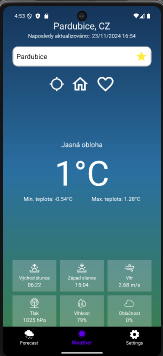
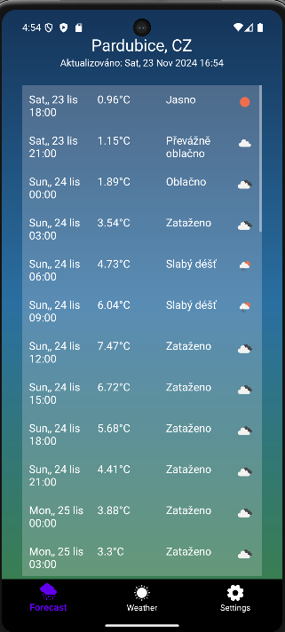
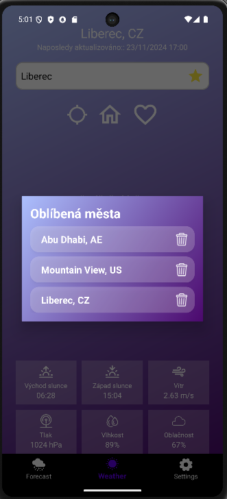
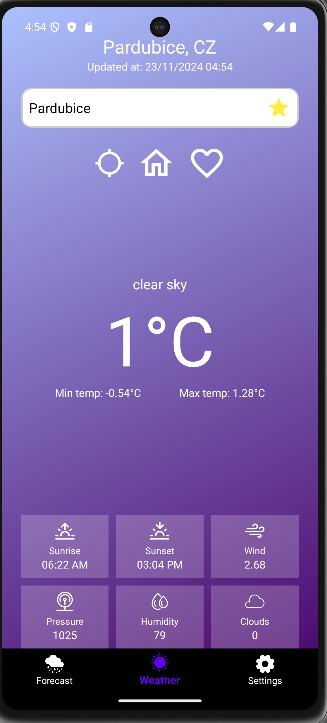
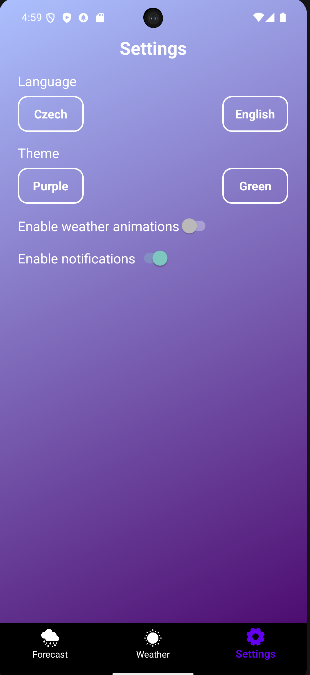
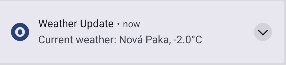

WeatherApp - PMA Semestral Project ☁️🌦️
==================================

Popis 📜
--------

Tato aplikace poskytuje aktuální předpověď počasí a předpověď na 5 dní dopředu. Uživatelé mohou snadno vyhledávat města, zobrazovat předpovědi na budoucí dny a využívat filtrování pro dostupná města prostřednictvím API. Aplikace podporuje světlý a tmavý režim a je navržena jako multijazyčná aplikace. 🌍

Funkce 🚀
---------

*   **Aktuální předpověď počasí:** Zobrazení aktuální teploty a povětrnostních podmínek. 🌡️

*   **Předpověď počasí na den dozadu a 5 dní dopředu:** Umožňuje uživatelům plánovat na základě budoucího počasí. 📅

*   **Aktuální stav počasí z domácí meteostanice:** Zobrazení aktuálních dat o počasí z domácí meteostanice. 🏡

*   **Vyhledávání měst:** Rychlé a snadné vyhledání dostupných měst z OpenWeatherMap API. 🔍

*   **JSON Parsing:** Efektivní zpracování dat z API pro přesné zobrazení informací. 📊

*   **Ukládání do databáze:** Historie a budoucí předpovědi jsou uloženy pro snadný přístup. 💾

*   **Oblíbená města:** Uživatelé mohou ukládat a načítat oblíbená města pro rychlý přístup. ⭐

*   **Změna motivu:** Uživatelé si mohou vybrat mezi 2 vizuálními styly. 🌞🌙

*   **Multijazyčná aplikace:** Možnost přepínání mezi českým a anglickým jazykem. 🌐

*   **Notifikace:** Uživatelé dostávají každou hodinu notifikace o aktuální teplotě z domácí stanice. 📩

*   **Podpora geolokace:** Uživatelé mohou získat aktuální předpověď počasí pro svou polohu. 📍

*   **Animace počasí:** Vizuální zobrazení počasí pomocí animací. 🌪️ - NOT IMPLEMENTED YET

Technologie 🛠️
---------------

*   **Android**: Hlavní platforma pro aplikaci. 📱

*   **Kotlin**: Programovací jazyk použitý pro vývoj aplikace. 💻

*   **SQLite**: Databázový systém pro ukládání historických dat a předpovědí. 🗄️

*   **OpenWeatherMap API**: API pro získávání aktuálních a budoucích předpovědí počasí. ☁️

*   **Personal Weather Station API**: Domácí API pro získávání aktuáních dat o počasí z meteostanice na zahradě. 🌡️ 

Fotky 📸
---------------

| **Hlavní stránka** | **Předpověď** | **Oblíbená města**                                                                 |
|---|---|------------------------------------------------------------------------------------|
|  |  |  |

| **Dashboard (Purple Theme)** | **Nastavení** | **Notifikace** |
|---|---|---|
|  |  |  |

Jak spustit ⚙️
--------------

1.  Zkopírovat kód
```
git clone https://github.com/asuchardaa/WeatherApp.git
```

2.  Otevřete projekt v Android Studiu. 📖

3.  Ujistěte se, že máte platný API klíč pro OpenWeatherMap a vložte ho do BuildConfig. 🔑

4.  Spusťte aplikaci na zařízení nebo emulátoru. 🚀


Příspěvky 🤝
------------

Příspěvky jsou vítány! Pokud chcete přidat novou funkci nebo opravit chybu, vytvořte pull request. 💡

License 📄
----------

Tento projekt je licencován pod [MIT License](https://github.com/asuchardaa/WeatherApp?tab=MIT-1-ov-file) 🛡️